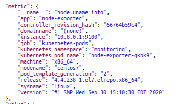

# Khái niệm 
- Prometheus là một phần mềm mã nguồn mở 100%, đây là một dịch vụ được tạo ra chủ yếu cho việc theo dõi và cảnh báo hệ thống.
# Tính năng 
- Mô hình theo kiểu timestamp phù hợp để theo dõi dữ liệu theo thời gian
- Có ngôn ngữ truy vấn riêng: PromQL(Prometheus Query Language)
- Hạ tầng triển khai đơn giản 
- Hỗ trợ [Service discovery](https://edwardthienhoang.wordpress.com/2018/09/13/microservices-tu-thiet-ke-den-trien-khai-phan-4-service-discovery-truy-tim-dich-vu/) trong microservices để  ngắm, tìm mục tiêu cần theo dõi 
- Hỗ trợ Push Gateway(khi làm việc với mục tiêu trong thời gian ngắn, hủy sau khi hoàn thành)

# Đặc điểm
- Prometheus là một mã nguồn mở được, các tính năng chủ yếu được phát triển bằng Go, ngoài ra có thêm như Java, Ruby, Python
- Cơ chế chủ yếu sẽ là đi lấy( pull) từ máy chủ remote là chính, chứ không sử dụng cơ chế  đợi (push) remote đẩy ngoài trừ việc dùng Push Gateway
- Metric dùng theo dạng chuẩn OpenMetrics 
- Prometheus dùng [Alertmanager](https://github.com/prometheus/alertmanager) để  xử lý, gửi đi các cảnh báo 
- Về giao diện, Prometheus dùng [Grafana](https://grafana.com/) để  tích hợp hiển thị các biểu đồ 
# Kiến trúc 
- Mô hình chủ yếu về Prometheus mà chúng ta thường thấy: 

- Thành phần của Prometheus chủ yếu bao gồm:
    + Máy chủ Prometheus 
    + Thư viện để kết nối đến Prometheus( ví dụ trong Python ta có: [prometheus_client](https://github.com/prometheus/client_python)) ngoài ra có thể sử dụng dạng json nếu như ngôn ngữ đó không có thư viện hỗ trợ
    + Alertmanager: dịch vụ quản lý, xử lý cảnh báo 
    + Push Gateway Prometheus: xử lý các công việc tạm thời.Đơn giản ta có thể hiểu là các công việc tạm thời đó tồn tại không đủ lâu để  Prometheus có thể chủ động lấy dữ liệu. Vì vậy các công việc sẽ được đẩy về Push Gateway và sau đó đẩy về Prometheus server
    + Exporter hỗ trợ giám sát dịch vụ hệ thống và đẩy về Prometheus theo quy chuẩn mà Prometheus mong muốn
# Một vài thuật ngữ quan trọng
  - Time-series Data: là một chuỗi dữ liệu, thường bao gồm các phép đo liên tiếp được thực hiện cùng một nguồn trong một khoảng thời gian
  - Alert: một cảnh báo thỏa mãn được rule cảnh báo được cấu hình trong Prometheus sẽ được gửi đến dịch vụ Alertmanager
  - Alertmanager: dùng để xử lý, gửi đi các cảnh báo thỏa mãn rule được cấu hình trong Prometheus
  - Client Library: một số các thư viện hỗ trợ người dùng đẩy, lấy dữ liệu từ Prometheus
  - Endpoint: nguồn dữ liệu của các chỉ số (metric) mà Prometheus lấy thông tin
  - PromQL: là cụm từ viết tắt của Prometheus Query Language, đây là một ngôn ngữ truy vấn riêng của Prometheus cho phép truy vấn để  thực hiện các thao tác dữ liệu từ Prometheus
  - Instance: một instance là một nhãn (label) dùng để định danh duy nhất cho một target trong một job. Ví dụ: 

     
                    (2)
       + trong ví dụ này ta có thể thấy job là: kubernetes-pod và địa chỉ ip 10.8.0.1 với port 9000 là một instance
  - Target: một target được định nghĩa là một nguồn mà Prometheus đi lấy dữ liệu(scrape), như ảnh minh họa ở trên(2) thì target ở đây là 10.8.0.1:9000
  - Exporter: là một chương trình với mục đích thu thập, chuyển đổi các dữ liệu không chuẩn thành dạng dữ liệu chuẩn của Prometheus. Tiếp đó exporter sẽ expose web service api chứa các thông tin của metrics hoặc đẩy về Prometheus
  - Sample: là một giá trị đơn lẻ tại một điểm thời gian trong một khoảng thời gian timeseries

