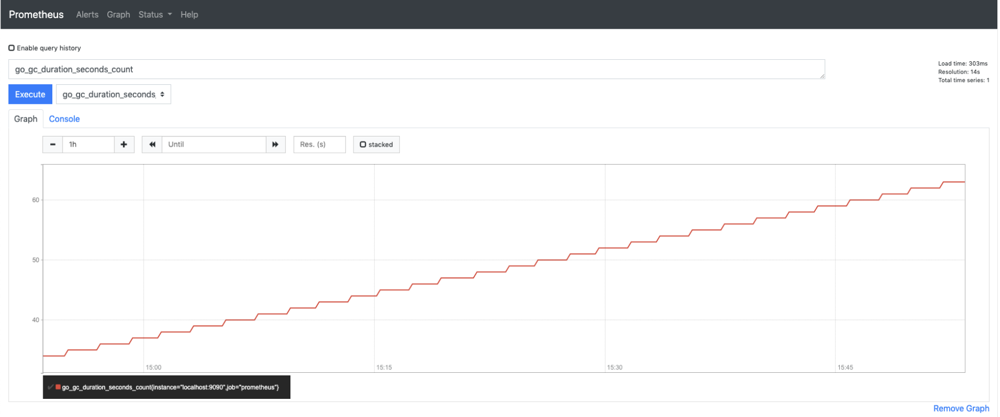

# Hướng dẫn cài đặt Prometheus

- Môi trường: Ubuntu 18.04
        
# Đăng nhập user root
sudo su -
# Cài đặt phiên bản mới nhất của Prometheus
wget https://github.com/prometheus/prometheus/releases/download/v2.2.1/prometheus-2.2.1.linux-amd64.tar.gz
# Extract file using tar
tar -xzvf prometheus-2.2.1.linux-amd64.tar.gz
# Cd vào thư mục
cd prometheus-2.2.1.linux-amd64/
# Vì Prometheus cần owner và group riêng của nó để chạy nên chúng ta sẽ tạo owner, group cho Prometheus:
    ## tạo group
        groupadd --system promethues
    ## tạo user:
        useradd -s /sbin/nologin -r -g prometheus prometheus            
# Tạo configuration và thư mục data của Prometheus
    mkdir -p /etc/prometheus/{rules,rules.d,files_sd}  /var/lib/prometheus
# Sao chép Prometheus binary file vào $PATH
    - Ở đây chúng ta sẽ sao chép vào /usr/local/bin vì thưc mục thường được sử dụng để đặt các tệp binary, nó là mặc định của $PATH và nó không can thiệp vào các tệp binary của hệ thống:
        cp prometheus promtool /usr/local/bin  
# Copy console và console libraries để config files directory
    cp -r consoles console_libraries /etc/prometheus/
# Tạo system unit file và chạy prometheus
    - Trước tiên hãy gõ lệnh sau:
        cd /lib/systemd/system
        touch prometheus.service 
    - Ở Ubuntu 18.04 sử dụng systemd init system làm mặc định, nên chúng ta cần tạo service unit file để  quản lý service của prometheus. Đuôi cuối file khi tạo phải là đuổi .service. Nội dung đoạn file như sau:
    # cat /etc/systemd/system/prometheus.service
    [Unit]
    Description=Prometheus systemd service unit
    Wants=network-online.target
    After=network-online.target

    [Service]
    Type=simple
    User=prometheus
    Group=prometheus
    ExecReload=/bin/kill -HUP $MAINPID
    ExecStart=/usr/local/bin/prometheus \
    --config.file=/etc/prometheus/prometheus.yml \
    --storage.tsdb.path=/var/lib/prometheus \
    --web.console.templates=/etc/prometheus/consoles \
    --web.console.libraries=/etc/prometheus/console_libraries \
    --web.listen-address=127.0.0.1:9090

    SyslogIdentifier=prometheus
    Restart=always

    [Install]
    WantedBy=multi-user.target 
    - Sau đó enable prometheus bằng lệnh: 
        systemctl enable prometheus
    - Sau đó start prometheus bằng lệnh: 
        systemctl start prometheus
- Và chạy systemctl status prometheus sẽ ra hình như sau:
    

- Sau khi chạy xong ta có thể mở trình duyệt lên và gõ: 
    http://127.0.0.1:9090/graph
    ( port mặc định của prometheus là 9090, mặc định prometheus sẽ tự monitoring chính nó )

    